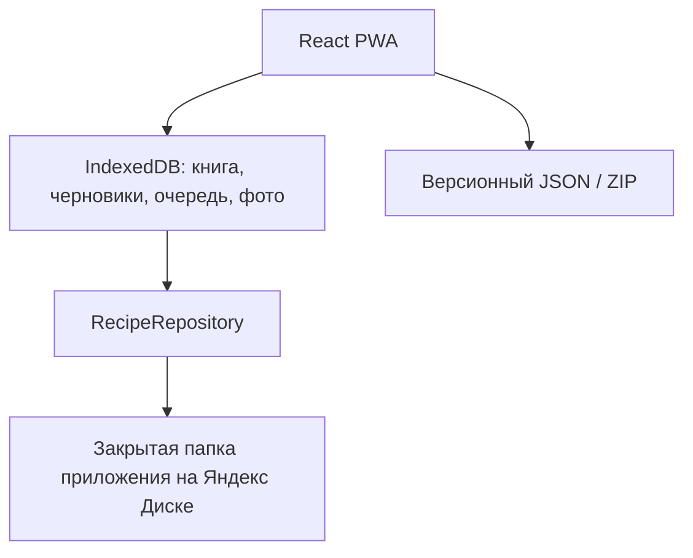

# Рецепты

Личная электронная книга рецептов: сайт на русском языке, mobile-first PWA для Android и одновременно удобный настольный инструмент для переноса старых записей. Интерфейс работает без APK и Google Play, устанавливается на главный экран и сохраняет изменения локально даже без интернета.

Версия приложения: `1.3.0`.

Рабочий адрес: https://kemeriets.github.io/maminy-recepty/.

**Текущее состояние:** сайт опубликован на GitHub Pages. В `public/runtime-config.js` ещё не задан `yandexClientId`, поэтому сейчас рецепты и фотографии сохраняются только локально, в браузере каждого устройства. Облачная синхронизация не включена автоматически. Исходники и обновления сайта не содержат ваших добавленных рецептов.

## Как пользоваться

1. Нажмите **Добавить рецепт**. Название, хотя бы один ингредиент и один шаг обязательны. Фото, категория, время, порции и заметка — по желанию.
2. Ищите по названию или ингредиенту. Категории, **Все рецепты** и **Любимые** переключают разделы. **Фильтры** открывают компактное окно возле кнопки; изменения сразу видны в каталоге. Крестик в строке поиска очищает запрос.
3. В рецепте можно изменить порции, включить **Режим готовки**, отправить ингредиенты в **Покупки**, редактировать или поделиться полным текстом. Пересчёт и отметки шагов не изменяют исходный рецепт.
4. Для большого переноса откройте **Настройки → Импорт и восстановление → Массовый импорт**. Скачайте инструкцию для нейросети, приложите снимки, загрузите полученный JSON и проверьте предпросмотр. Фотографии передаются ZIP-архивом либо вместе с JSON отдельными файлами с совпадающими именами.
5. Регулярно скачивайте **Настройки → Резервная копия → Рецепты и фото · ZIP**. На другом устройстве откройте тот же сайт и загрузите ZIP через импорт. По умолчанию импорт добавляет записи; полная замена требует отдельного подтверждения.

Рецепты переживают закрытие и повторный запуск браузера, но очистка данных сайта, удаление профиля, приватный режим или сбой устройства могут уничтожить локальную копию. Не очищайте данные сайта без ZIP. GitHub Pages хранит приложение, а не пользовательские рецепты. После настройки Яндекс Диска изменения синхронизируются между устройствами, вошедшими в один аккаунт. Это дополнение к резервным копиям, а не их замена. Справка также доступна внутри сайта в **Настройки → Как пользоваться**.

## Главное об эксплуатации

Основной вариант для использования в России:

- статический PWA размещён на **GitHub Pages**;
- тот же PWA можно дополнительно разместить на **GitVerse Pages** как независимый запасной адрес;
- после настройки и подключения рецепты и фотографии синхронизируются с закрытой папкой приложения на **Яндекс Диске**;
- каждое изменение сначала сохраняется в IndexedDB на устройстве;
- облачная синхронизация выполняется после единственного входа через Яндекс ID;
- в репозитории и на публичном сайте нет семейных рецептов, фотографий, паролей или OAuth-токенов;
- независимый JSON/ZIP backup позволяет уйти на другой backend.

Старый вариант ChatGPT Sites/Cloudflare оставлен в исходниках как резервный backend, но не рекомендуется как основной российский адрес: Cloudflare [официально сообщает о системном ограничении трафика российскими провайдерами](https://blog.cloudflare.com/russian-internet-users-are-unable-to-access-the-open-internet/).

## Возможности

- каталог и быстрый поиск по названию, описанию, ингредиентам, тегам и заметкам;
- фильтры по категории, избранному и наличию фотографии;
- добавление, редактирование, перестановка ингредиентов и шагов;
- съёмка камерой и выбор снимка из галереи;
- сжатие фотографий до WebP/JPEG, отдельные миниатюры и читаемые оригиналы страниц;
- просмотр рукописной страницы на весь экран с увеличением;
- режим готовки с крупным текстом, отметками шагов и Screen Wake Lock;
- пересчёт числовых ингредиентов на другое количество порций;
- избранное и список покупок с объединением одинаковых позиций;
- корзина и окончательное удаление только после подтверждения;
- ручной настольный режим «страница слева, форма справа»;
- массовый JSON/ZIP-импорт с проверкой и привязкой исходных фотографий;
- JSON и полный ZIP backup с восстановлением;
- offline-first кэш, локальные черновики и очередь синхронизации;
- установочный PWA manifest, service worker и понятное обновление версии;
- редактируемые категории;
- демонстрационные рецепты, удаляемые одной кнопкой.

## Архитектура



Стек:

- React 19, TypeScript 5 strict, Vite 8;
- лёгкие headless-компоненты Base UI/Shadcn без готовой тяжёлой темы;
- IndexedDB для локального состояния;
- Yandex Disk REST API и OAuth 2.0 для приватной синхронизации;
- Vitest для логики, Playwright для smoke-сценария;
- отдельная совместимая Vinext/Cloudflare Workers сборка с D1/R2.

Компоненты не обращаются к облаку напрямую. Они используют `BookProvider` и `RecipeRepository`, поэтому хранилище можно заменить без переписывания интерфейса.

### Как хранится книга в Яндекс Диске

Приложение запрашивает только право `cloud_api:disk.app_folder`. Оно не читает остальные файлы Диска.

```text
Приложения/Рецепты/
  operations/             отдельные версионные JSON-операции
  images/                 сжатые фотографии и миниатюры
```

Книга не складывается в один огромный изменяемый документ. У каждой операции уникальный `opId`; повторная отправка безопасна, а устройства воспроизводят операции в одинаковом порядке. Для одновременного изменения одного рецепта используется понятная стратегия last-write-wins. Независимые рецепты друг другу не мешают.

[Документация Yandex Disk REST API](https://yandex.com/dev/disk/rest/) прямо предусматривает хранение настроек приложения и синхронизацию между устройствами. Токен привязан одновременно к конкретному приложению, пользователю и выбранным правам.

## Проверка бесплатности и доступности

Проверено по официальной документации 6 сентября 2026 года.

| Сервис | Что подтверждено | Решение |
|---|---|---|
| [GitVerse Pages](https://gitverse.ru/docs/pages/overview) | доступен на тарифе Free; статические сайты; артефакт до 500 МБ | основной российский хостинг PWA |
| [GitHub Pages](https://docs.github.com/en/pages/getting-started-with-github-pages/what-is-github-pages) | доступен для публичных репозиториев на GitHub Free | независимое зеркало PWA |
| [Яндекс Диск REST API](https://yandex.com/dev/disk-api/doc/en/concepts/quickstart) | OAuth и отдельное право только на папку приложения | приватные данные в объёме обычного Диска пользователя |
| [Cloudflare](https://developers.cloudflare.com/support/troubleshooting/general-troubleshooting/service-disruption/) | в РФ возможна деградация/недоступность | не использовать как основной адрес |
| [Firebase Storage](https://firebase.google.com/docs/storage/faqs-storage-changes-announced-sept-2024) | для Storage требуется billing/Blaze | не выбран |

GitVerse Pages, GitHub Pages и вход в Яндекс не требуют привязки банковской карты для этой архитектуры. Это не обещание «бесплатно навсегда»: тарифы и правила могут измениться. Поэтому backup обязателен, а формат данных не зависит от поставщика.

Важно: GitVerse Pages сейчас требует публичный репозиторий и пока [не поддерживает собственные домены](https://gitverse.ru/docs/pages/faq). Пользовательские данные туда не попадают. Все URL в PWA относительные, поэтому позже сборку можно перенести на другой российский статический хостинг с собственным доменом без изменения экранов или данных.

## Быстрый локальный запуск

Требования: Node.js `22.13` или новее и npm.

```bash
npm ci
npm run dev:portable
```

Откройте адрес Vite. Без Client ID приложение работает полностью локально: рецепты остаются в IndexedDB браузера, а в настройках честно отображается «только на этом устройстве».

Production-проверка переносимой версии:

```bash
npm run build:portable
npm run preview:portable
```

Готовая статика появляется в `dist-portable/`.

Резервная Sites/Worker-сборка:

```bash
npm run dev
npm run build
```

## Однократная публикация на GitVerse Pages

Репозиторий уже содержит `.gitverse/workflows/pages.yml`. Workflow устанавливает зависимости, запускает unit-тесты, собирает `dist-portable` и публикует его официальными GitVerse Pages actions.

1. Создайте публичный репозиторий `maminy-recepty` в GitVerse и включите для него CI/CD.
2. Добавьте remote и отправьте ветку:

   ```bash
   git remote add gitverse https://gitverse.ru/ВАШ_ЛОГИН/maminy-recepty.git
   git push gitverse HEAD:master
   ```

3. Откройте `Настройки → Страницы`, включите GitVerse Pages и выберите источник `Воркфлоу`.
4. Дождитесь зелёного запуска. Адрес проекта будет иметь вид `https://ВАШ_ЛОГИН.gitverse.site/maminy-recepty/`.

Точные требования и адреса описаны в [официальном быстром старте GitVerse Pages](https://gitverse.ru/docs/pages/quick-start).

## Запасной адрес на GitHub Pages

Репозиторий также содержит `.github/workflows/pages.yml`. На публичном репозитории GitHub Actions и Pages доступны бесплатно; workflow сам проверяет проект, собирает PWA и публикует только папку `dist-portable`.

1. Создайте публичный репозиторий `maminy-recepty` на GitHub и отправьте в него ветку `main`.
2. В `Settings → Pages → Build and deployment` выберите `GitHub Actions`, если GitHub не включил Pages автоматически.
3. Дождитесь зелёного workflow `Publish GitHub Pages`.
4. Используйте выданный HTTPS-адрес как запасной либо временный основной адрес.

Рецепты, фотографии и токен Яндекса в GitHub не отправляются: репозиторий содержит только исходный код и демонстрационные данные. Ограничения GitHub Pages — опубликованный сайт до 1 ГБ и мягкий лимит трафика 100 ГБ в месяц — многократно больше потребностей одной семейной книги.

### Настройка Яндекс OAuth

Делается один раз, после получения окончательного HTTPS-адреса.

1. Войдите в Яндекс под аккаунтом владельца приложения и откройте [создание приложения для авторизации пользователей](https://oauth.yandex.ru/client/new/id/). Не выбирайте «Для доступа к API или отладки»: у этого типа нельзя задать собственный Redirect URI. [Официальная инструкция](https://yandex.ru/dev/id/doc/ru/register-auth).
2. Название: `Рецепты`. Укажите контактную почту; для иконки используйте `public/icons/icon-192.png`.
3. Платформа: веб-сервис.
4. Redirect URI для текущего сайта: `https://kemeriets.github.io/maminy-recepty/`, обязательно с завершающим `/`. Для другого хостинга добавьте его полный HTTPS-адрес в Redirect URI того же приложения. Используйте один ClientID на всех устройствах и зеркалах: разные ClientID означают разные папки приложения на Диске.
5. Оставьте единственное право Яндекс Диска: **доступ к папке приложения** (`cloud_api:disk.app_folder`). Не выдавайте чтение или запись всего Диска.
6. Создайте приложение и скопируйте публичный `ClientID`.
7. Для первого входа можно сразу вставить ClientID в **Настройки → Настроить синхронизацию → ClientID** и нажать **Сохранить и войти через Яндекс**. Идентификатор сохранится только в этом браузере. Для настройки всех устройств вставьте его в `public/runtime-config.js`:

   ```js
   window.__MAMINY_RECIPES_CONFIG__ = {
     provider: "yandex-disk",
     yandexClientId: "ПУБЛИЧНЫЙ_CLIENT_ID",
     assetBase: "./"
   };
   ```

8. Сделайте новый commit и push. GitHub Actions автоматически обновит PWA.

Яндекс может показать предупреждение о неверифицированном приложении. Сверьте имя созданного вами приложения и единственное разрешение. Не подтверждайте неожиданный доступ к почте, профилю или всему Диску.

`ClientID` не является секретом и по протоколу OAuth находится в браузере. OAuth access token никогда не записывается в Git, HTML или конфигурацию: он остаётся в IndexedDB конкретного устройства. Встроенная Content Security Policy запрещает сторонние скрипты.

## Первый вход и устройства

Самый простой надёжный сценарий для одной книги:

1. Использовать мамин Яндекс-аккаунт как владельца семейной книги.
2. На её телефоне открыть сайт и нажать `Настройки → Подключить Яндекс Диск`.
3. Разрешить доступ только к папке приложения.
4. На компьютере для массового переноса один раз подключить тот же аккаунт.
5. После первого большого импорта скачать полный ZIP.

Сессия хранится долго; каждый день вводить пароль не требуется. Приложение не получает и не хранит пароль. Чтобы видеть одну книгу на нескольких устройствах, они должны войти в один и тот же Яндекс-аккаунт. Архитектура `bookId`/репозитория позволяет позже заменить это на отдельные семейные аккаунты.

Если облако ещё не подключено или временно недоступно, создавать и править рецепты всё равно можно. Плашка показывает фактическое состояние, а очередь отправится при следующей синхронизации.

### Новые удобства интерфейса

В **Случайном** (на компьютере **Что приготовить?**) выберите категорию и нажмите **Выбрать блюдо**. Предыдущее блюдо не повторяется, если есть другие варианты. Удалённые рецепты не участвуют. В **Покупках** есть **Убрать купленное** и **Очистить весь список** с подтверждением. Очистка не затрагивает рецепты и не удаляет новые покупки, добавленные другим устройством позже.

Поля описания, шагов, уточнений и заметок автоматически растут вниз, а для очень длинного текста появляется внутренний вертикальный скролл. Переносится и длинное слово без пробелов. Лимит заметки и комментария — 40 000 символов, описания — 10 000. Архивные фотографии сохранены в данных, импорте и ZIP, но больше не показываются на странице рецепта или в форме для мамы.

### Синхронизация и память телефона

Сохранение сначала фиксирует рецепт и очередь отправки одной транзакцией IndexedDB. Фотографии сжимаются до 1600 px (архивные страницы до 2400 px) и получают миниатюру. Затем отправляются отдельные JSON-операции и файлы в приватную папку приложения на Яндекс Диске. Новое устройство получает тексты всех рецептов, но не весь Диск и не все полноразмерные фотографии. Фото подгружаются при просмотре; миниатюры — для видимых карточек. Фото несохранённых черновиков не отправляются.

Изменения отправляются при сохранении. Повторная отправка и получение изменений происходят при возвращении в приложение, восстановлении интернета и примерно раз в минуту, пока приложение открыто. Есть ручная кнопка **Синхронизировать**. Это не push-сервис: браузер может останавливать фоновую вкладку; перед выходом проверьте очередь. При сетевой ошибке книга остаётся локально, а индикатор не сообщает ложный успех. Одновременно редактировать один рецепт с двух устройств не рекомендуется: применяется последняя по времени операция.

PWA занимает место. Файлы интерфейса этой версии — около 1–2 МБ без сжатия; дополнительно Android/Chrome хранит служебные данные установленного приложения. Тексты, очередь и неотправленные фото хранятся на телефоне. Кэш уже загруженных облачных фото ограничен **24 МБ**, старые файлы вытесняются и повторно загружаются через интернет. Лимит не относится к черновикам, неотправленным фото и ZIP-копиям в «Загрузках». До подключения синхронизации место растёт вместе с фотографиями.

**Настройки → Место на устройстве** показывает оценку расхода хранилища браузера; она может включать другие приложения на том же origin `kemeriets.github.io`. Android показывает служебный размер отдельно. **Очистить кэш фото** удаляет только повторно загружаемые изображения — не рецепты, черновики или файлы, ожидающие отправки. Без интернета очищенные фото временно недоступны. Полный ZIP всё равно нужен: синхронизация передаёт также удаления и не заменяет независимую резервную копию.

На 15 сентября 2026 официальный бесплатный объём обычного Яндекс Диска — **5 ГБ**; он общий с остальными файлами аккаунта, а не отдельные 5 ГБ для приложения. [Официальная справка](https://yandex.ru/support/yandex-360/customers/disk/web/ru/enlarge). Бесплатные условия могут измениться.

## Установка на Android

1. Откройте HTTPS-адрес в Chrome.
2. Нажмите кнопку установки в настройках книги. Если она не появилась, откройте меню Chrome `⋮` и выберите `Установить приложение` или `Добавить на главный экран`.
3. На главном экране появится иконка «Рецепты». Старое название уже установленного приложения может обновиться не сразу — это зависит от Chrome.
4. После запуска приложение открывается без адресной строки.

Когда выходит новая версия, появляется плашка `Доступно обновление`. Кнопка `Обновить` активирует новый service worker; старые кэши с другой версией удаляются.

## Название и оформление

Основные подписи находятся в одном файле — `config/app.config.ts`:

```ts
export const APP_CONFIG = {
  appName: "Рецепты",
  shortName: "Рецепты",
  momName: "Мама",
  giftFrom: "Дима",
  familyName: "Семья",
  dedicationTitle: "Книга рецептов",
  dedicationText: "...",
  showGiftIntro: false,
  version: "1.2.0",
  theme: { /* основные цвета */ },
  defaultCategories: [/* ... */],
  defaultAuthors: [], // только для совместимости со старыми копиями
};
```

При `npm run build:portable` название, короткое имя и цвета PWA manifest, `<title>` и meta theme-color создаются из этой конфигурации. После изменения конфигурации выполните commit/push.

Категории можно добавлять в самом приложении. Значения из конфигурации нужны только для новой книги. Авторов в интерфейсе нет. Старые `authors`/`authorId` в данных и резервных копиях сохранены для совместимости; новый рецепт создаётся без автора.

## Перенос старой книги

Откройте `Настройки → Импорт и восстановление` на компьютере.

### Вручную

1. Выберите сразу фотографии страниц.
2. Слева останется крупный оригинал, справа — форма.
3. Ингредиенты вводятся строками `Название | количество | единица | заметка`.
4. Каждый шаг вводится с новой строки.
5. Нажмите `Сохранить и перейти дальше`.

Для каждой фотографии сохраняется отдельный локальный черновик.

### Пачкой через нейросеть

Готовые файлы:

- `public/examples/ai-import-prompt.txt` — инструкция для нейросети;
- `public/examples/recipes-import.example.json` — рабочий пример;
- `public/examples/recipe-import.schema.json` — формальная JSON Schema.

Передайте нейросети фотографии и промпт. Она должна вернуть JSON, но не сохранять результат автоматически. Приложение валидирует структуру и показывает список до импорта.

Пример:

```json
{
  "schemaVersion": 1,
  "source": "Фотографии старой книги",
  "recipes": [
    {
      "title": "Торт «Черепаха»",
      "category": "Десерты",
      "author": "Мама",
      "ingredients": [
        { "name": "Яйца", "amount": 3, "unit": "шт." },
        { "name": "Соль", "amount": "по вкусу", "unit": "" }
      ],
      "steps": ["Смешать ингредиенты.", "Выпечь до золотистого цвета."],
      "originalPageImages": [
        { "fileName": "page-01.jpg", "alt": "Оригинальная страница" }
      ]
    }
  ]
}
```

Выберите JSON и изображения одновременно либо положите их в один ZIP. Поддерживаются стратегии дубликатов: пропустить, заменить, добавить копию. Новые категории создаются автоматически. Поле автора в старых JSON остаётся поддержанным для совместимости, но не показывается в интерфейсе.

## Backup и восстановление

В настройках есть два формата:

- **JSON** — быстрый человекочитаемый файл со всеми текстами, авторами, категориями, корзиной и покупками;
- **ZIP** — `recipes.json` плюс `/images` и `/original-pages`.

Каждая копия содержит `schemaVersion`, `appVersion` и `exportedAt`. Большую фототеку лучше архивировать с компьютера.

Для восстановления выберите JSON/ZIP в разделе импорта, проверьте список, нажмите `Восстановить книгу целиком` и отдельно подтвердите замену. Без подтверждения существующие рецепты не удаляются.

Рекомендуемый минимум: полный ZIP после большого импорта и раз в несколько месяцев; JSON после заметных правок. Храните копии минимум в двух независимых местах.

## Фотографии и память телефона

1. Браузер исправляет ориентацию через `createImageBitmap`.
2. Фото блюда уменьшается до 1600 px по длинной стороне.
3. Рукописная страница сохраняется до 2400 px для читаемости.
4. Миниатюра уменьшается до 520 px.
5. Сначала Blob попадает в IndexedDB, поэтому обрыв сети не теряет снимок.
6. Затем основное фото и миниатюра уходят в закрытую папку приложения.
7. Каталог загружает миниатюры лениво; крупный оригинал — только по нажатию.

Service worker обслуживает приватные изображения через локальный URL, использует кэш IndexedDB и только при необходимости получает краткоживущую ссылку Яндекс Диска.

## Безопасность

- публичный GitVerse-репозиторий содержит только код и демонстрационные данные;
- реальные рецепты и снимки никогда не попадают в GitVerse Pages;
- приложение просит только `cloud_api:disk.app_folder`;
- OAuth использует случайный `state` и точный Redirect URI;
- access token хранится только локально и удаляется кнопкой отключения;
- Content Security Policy не разрешает сторонние скрипты;
- нет аналитики, рекламы и трекеров;
- изменения сначала локальные, поэтому сетевая ошибка не очищает форму;
- полный экспорт не привязан к Яндексу или Cloudflare.

Подробности резервного Worker-backend находятся в `SECURITY.md`. Никогда не добавляйте токены, cookies или пароли в Git.

## Тестирование

```bash
npx tsc --noEmit
npm run test:unit
npm run lint
npm run build:portable
npm run build
npm run test:e2e
```

Тесты покрывают CRUD-операции, поиск, фильтры, порции, импорт, экспорт, восстановление, IndexedDB и PWA. E2E smoke открывает книгу, ищет Шарлотку, создаёт и редактирует рецепт, затем добавляет его в избранное.

## Обновление приложения

1. Измените код и `APP_CONFIG.version`.
2. При изменении offline-оболочки увеличьте `CACHE_VERSION` в `public/sw.js`.
3. Запустите TypeScript, unit-тесты, lint и обе production-сборки.
4. Сделайте commit/push в GitVerse.
5. После публикации установленная PWA предложит обновиться.

GitVerse автоматически запускает workflow при каждом push в `main` или `master`.

## Перенос на другой backend или хостинг

1. Скачайте полный ZIP.
2. Разместите `dist-portable/` на любом HTTPS static hosting; относительные URL поддерживают корень и подпапку.
3. Для нового облака реализуйте интерфейс `RecipeRepository` из `repositories/recipe-repository.ts`.
4. Оставьте модель `types/book.ts` или добавьте однократный mapper.
5. Импортируйте `recipes.json` и каталоги фотографий.
6. Прогоните существующие тесты импорта/восстановления.

Для PostgreSQL/Supabase сущности напрямую отображаются на таблицы. Для document storage сохраняйте отдельные записи/операции и не превращайте всю книгу в один документ. `bookId` уже заложен для будущих членов семьи.

## Структура проекта

```text
app/                     интерфейс и резервные Sites API routes
components/              экраны и доступные UI-примитивы
config/                  единая конфигурация подарка
features/book/           состояние, бизнес-логика и demo seed
portable/                входная точка независимой Vite PWA
repositories/            абстракция хранилища
services/                Яндекс Диск, изображения, IndexedDB, import/export
public/examples/         промпт, JSON-пример и JSON Schema
db/, drizzle/, server/   резервный D1/R2 backend и миграции
tests/                   unit/integration проверки
e2e/                     Playwright smoke
.gitverse/workflows/     автоматическая публикация GitVerse Pages
```

## Частые вопросы

### Написано «только на этом устройстве»

Это не ошибка: сейчас рецепты сохраняются в браузере этого устройства. Если в настройках написано «Синхронизация не настроена», владелец сайта должен один раз задать публичный ClientID Яндекса по инструкции выше. Пока переносите данные с помощью ZIP-копии. Не очищайте данные сайта без копии.

### После входа данные не появились на другом устройстве

Проверьте, что оба устройства подключены к одному Яндекс-аккаунту и в настройках нет ожидающих изменений. Нажмите `Синхронизировать`.

### Фотография долго обрабатывается

Большой снимок уменьшается прямо на устройстве. Дождитесь исчезновения индикатора перед сохранением.

### Нейросеть ошиблась в почерке

Импорт никогда не сохраняет распознавание вслепую. Исправьте JSON или импортируйте запись и сравните её с сохранённым оригиналом.

### Как гарантировать сохранность через десять лет

Ни один облачный сервис нельзя считать вечным. Храните ZIP минимум в двух местах. Внутри обычный JSON и изображения, которые можно прочитать без этого приложения.
